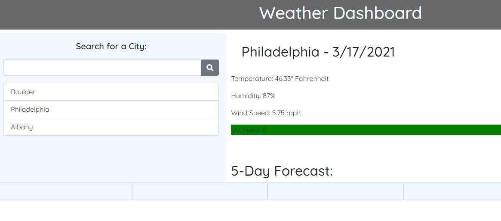

# Weather Dashboard

It almost works!

- Two successful API calls get data from https://openweathermap.org/ -- first to get a city's latitude and longitude, then to get useable weather data based on that
- Current weather successfully populates using data from the API, and the UV index has a color indicating safety levels

- Local storage...sort of does the thing. There are some issues with cities showing up in multiples.

- Had difficulty looping through the weather data to populate the cards for the five day forecast

- And there's a situation where cards generate every time weather data is brought up on the page

- There are no icons indicating weather conditions

https://artemissorrow.github.io/weather-dashboard/
